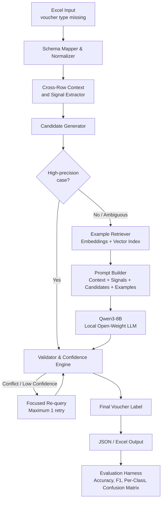
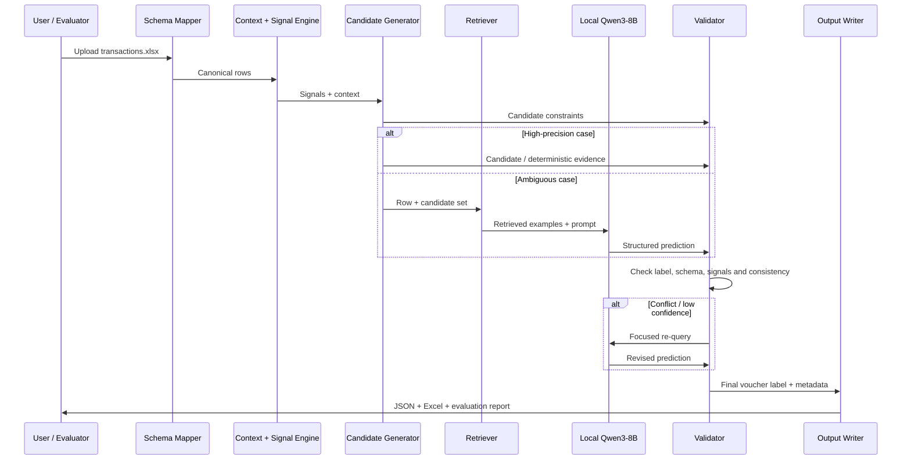
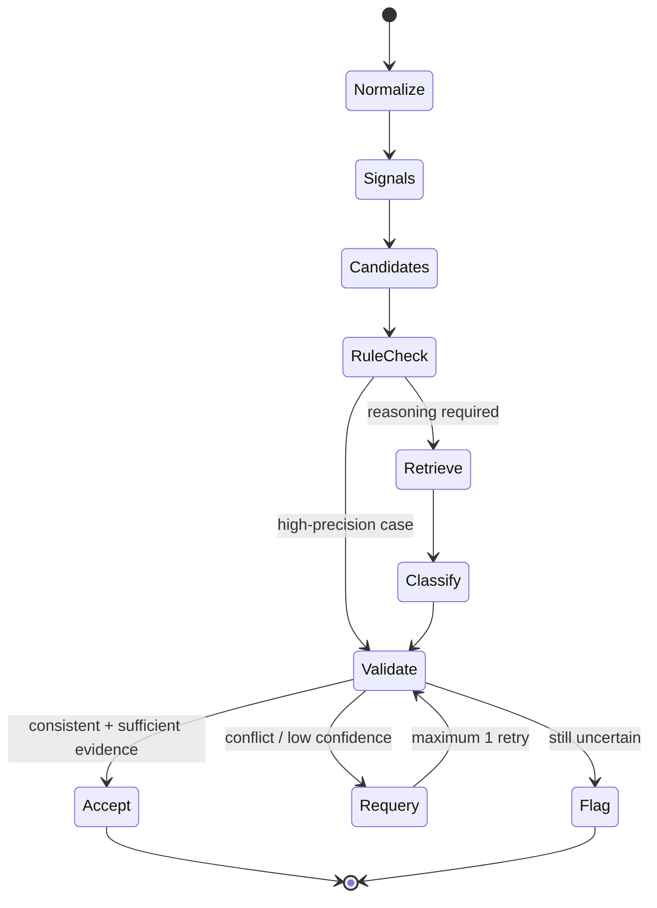

# VoucherIQ: Hybrid Open-Source LLM Voucher Classifier

> Hacktober Fest | Open Source AI Hackathon | Track 4: VYOM+ Intelligent Voucher Classification Using Open-Source LLMs
>
> **Team:** `MidNighters` | `Malhar Dongre`, `Tanishq Kale`, `Atharv Dubey`, `Shriraj Dhore`

---

## At a Glance

| | |
|---|---|
| **Problem** | Assign the correct accounting voucher type — one of the **27 organizer-defined categories** — to each already-structured transaction row, where the voucher-type field is missing |
| **Core idea** | Convert structured transaction data into **context-aware accounting signals**, generate a focused candidate set, ground an open-weight LLM with relevant examples, and validate every prediction |
| **Primary AI** | **Qwen3-8B** as the primary open-weight LLM candidate, run locally in quantized form; a short bake-off may select a better-performing compatible model before the final implementation is locked |
| **Inference** | Local model inference through **Ollama / llama.cpp-compatible runtime**, with structured JSON output |
| **Privacy** | Designed for fully local inference; financial data is not sent to a proprietary classification API |
| **Output** | `voucher_type` per row in JSON and Excel, with an optional calibrated confidence score, explanation, and `flag_for_review` |
| **Evaluation** | Reproducible evaluation using accuracy, macro/weighted precision, recall, F1, per-category metrics, confusion matrix, latency, throughput, and memory |

### What makes VoucherIQ different from "just prompt an LLM"?

1. **Context before classification:** transaction fields are normalized and converted into explicit accounting signals before the model sees them.
2. **Candidate generation:** the system narrows 27 categories to a smaller plausible set before semantic reasoning, reducing confusion and prompt size.
3. **Grounded reasoning:** retrieval supplies relevant worked examples for difficult category boundaries instead of relying only on the model's prior knowledge.
4. **Validator-first reliability:** the model never gets the final word on format or hard constraints; a validator checks the prediction and can trigger one focused re-query.
5. **Uncertainty-aware output:** the system always returns a valid category, while low-confidence or conflicting predictions are flagged for human review.

---

## Table of Contents

1. [Project Name](#1-project-name)
2. [Problem Statement](#2-problem-statement)
3. [Project Overview](#3-project-overview)
4. [Proposed Solution](#4-proposed-solution)
5. [Objectives](#5-objectives)
6. [Target Users / Use Case](#6-target-users--use-case)
7. [Open-Source AI Technology Selected](#7-open-source-ai-technology-selected)
8. [Why This Technology Was Selected](#8-why-this-technology-was-selected)
9. [AI's Role in the System](#9-ais-role-in-the-system)
10. [System Architecture](#10-system-architecture)
11. [Component-Level Architecture](#11-component-level-architecture)
12. [Data / Information Flow](#12-data--information-flow)
13. [Agentic Workflow](#13-agentic-workflow)
14. [Technology Stack](#14-technology-stack)
15. [Expected Features](#15-expected-features)
16. [Implementation Approach](#16-implementation-approach)
17. [Expected Final Output](#17-expected-final-output)
18. [Future Scope / Scalability](#18-future-scope--scalability)
19. [Open-Source Dependencies / Components](#19-open-source-dependencies--components)
20. [Expected Challenges and Mitigation](#20-expected-challenges-and-mitigation)

**Appendix A.** [Alignment with Judging Criteria and Submission Checklist](#appendix-a-alignment-with-judging-criteria-and-submission-checklist)

---

## 1. Project Name

# **VoucherIQ**

**VoucherIQ** is a hybrid classification system that combines structured accounting signals, retrieval-grounded reasoning, an open-weight LLM, and deterministic validation to classify structured financial transactions into the correct accounting voucher category.

---

## 2. Problem Statement

Accounting systems must assign every transaction the correct **voucher type**. The challenge provides structured transaction information while intentionally removing the voucher-type column. The system must infer the missing category from the complete transaction context.

This is difficult because many categories are semantically similar and contain overlapping fields:

- A transaction with seller, buyer, item lines, GST and values may represent either **Purchase** or **Sales**, depending on transaction direction.
- A money movement can resemble **Payment** or **Receipt**, but may actually be **Contra** when both sides are internal cash/bank accounts.
- A return can resemble a normal commercial invoice while requiring **Purchase Return / Debit Note** or **Sales Return / Credit Note**.
- Orders, receipt notes, delivery notes, rejections and material movements may contain quantities and parties but are not ordinary purchase/sales invoices.
- Salary, expense, advance and payment transactions can share parties and monetary fields while representing different accounting meanings.

The required system therefore cannot depend on a single keyword or isolated field. It must reason over **multiple related fields and, where useful, cross-row context**, while using an open-source/openly available LLM or suitable AI architecture as the primary intelligence layer.

This is **not an OCR or invoice-extraction problem**. The input transaction information is already structured in Excel.

---

## 3. Project Overview

VoucherIQ is an end-to-end classification pipeline rather than a single prompt.

It:

1. Loads and validates the organizer-provided Excel dataset.
2. Maps inconsistent or unknown column names into a canonical schema.
3. Normalizes values and identifies missing information.
4. Derives accounting-oriented signals and optional cross-row context.
5. Generates a small candidate set of plausible voucher categories.
6. Retrieves relevant labeled examples for difficult cases.
7. Uses a local open-weight LLM for contextual semantic classification.
8. Validates the output against the allowed taxonomy and hard signals.
9. Performs at most one focused re-query when a prediction conflicts with validation.
10. Returns the final category in machine-readable form.
11. Produces evaluation metrics when labeled data is available.

### Input / Output

| Item | Detail |
|---|---|
| **Input** | Excel (`.xlsx`) containing structured transaction data with voucher type omitted |
| **Core intelligence** | Local open-weight LLM |
| **Supporting intelligence** | Accounting signals, candidate generation, embeddings/retrieval, deterministic validation |
| **Output** | One voucher category per transaction row in JSON and/or Excel |
| **Optional metadata** | Confidence score, short explanation, review flag |
| **Execution model** | Local-first, no proprietary API as the primary classification engine |

### High-Level Flow

```text
Excel Dataset
      |
      v
Schema Mapping + Normalization
      |
      v
Cross-Row Context + Signal Extraction
      |
      v
Candidate Generation
      |
      +---------------------------+
      |                           |
      v                           v
High-Precision Case          Ambiguous Case
      |                           |
      |                           v
      |                  Example Retrieval
      |                           |
      |                           v
      |                    Open-Source LLM
      |                           |
      +-------------+-------------+
                    |
                    v
             Validation Engine
                    |
          +---------+---------+
          |                   |
      Consistent        Conflict / Low
          |             Confidence
          |                   |
          |                   v
          |             One Focused Retry
          |                   |
          +---------+---------+
                    |
                    v
            Final Voucher Label
                    |
                    v
             JSON / Excel Output
```

---

## 4. Proposed Solution

We propose a **context-aware hybrid classifier** rather than a direct `Excel -> LLM -> label` pipeline.

### Stage 1 — Schema Mapper & Normalizer

The system maps the incoming spreadsheet into a canonical schema even when column names vary.

Examples:

- `Supplier`, `Vendor`, `Seller Name` -> `seller`
- `Customer`, `Buyer Name` -> `buyer`
- `GST`, `GST Amount`, `Tax` -> canonical tax fields

It also normalizes dates, numbers, currencies, blank values, and text representations.

### Stage 2 — Signal Extraction

Instead of treating every cell as raw text, the system derives interpretable signals such as:

- presence of payroll fields
- presence of invoice/order/delivery references
- debit/credit structure
- return references
- presence or absence of commercial values
- item/quantity indicators
- currency and cross-border indicators
- party role relative to the home entity
- cash/bank account indicators

These signals are used to focus the model and support deterministic validation.

### Stage 3 — Candidate Generation

The full taxonomy contains 27 categories. Rather than forcing the model to compare every category for every transaction, the system generates a smaller **candidate set** based on available evidence.

Example:

```text
Transaction
    |
    +-- payroll fields? ------> Salary / Payroll, Payment
    |
    +-- return reference? ----> Purchase Return / Debit Note,
    |                           Sales Return / Credit Note
    |
    +-- bank/cash movement? --> Payment, Receipt, Contra
    |
    +-- order reference? -----> Purchase Order, Sales Order,
                                Job Work In Order, Job Work Out Order
```

Candidate generation is a constraint and efficiency layer; the LLM remains responsible for semantic disambiguation among plausible categories.

### Stage 4 — Retrieval-Grounded LLM Classification

For ambiguous transactions, the system retrieves relevant worked examples from a curated example bank using embeddings and vector similarity.

The LLM receives:

- normalized transaction context
- accounting signals
- candidate categories
- category definitions/disambiguation guidance
- relevant worked examples

It returns schema-constrained JSON containing the predicted voucher type and a concise reason.

### Stage 5 — Validation & Confidence

The validator checks:

- whether the predicted category belongs to the allowed taxonomy
- whether the prediction violates high-precision signals
- whether it is outside the generated candidate set without sufficient evidence
- whether the output matches the required JSON structure
- whether the prediction remains uncertain

When a conflict is detected, the system performs **one focused re-query** using the conflicting signals. If uncertainty remains, the transaction is still assigned a valid category but marked `flag_for_review = true`.

### Why Hybrid Instead of "Just Prompt an LLM"?

A pure rules system is brittle around semantically similar categories. A pure LLM system can be inconsistent and difficult to validate.

VoucherIQ combines:

**deterministic constraints + contextual signals + retrieval + open-weight LLM reasoning + deterministic validation**

so that each layer has a specific responsibility.

---

## 5. Objectives

1. Classify each transaction into exactly one of the **27 organizer-defined voucher categories**.
2. Improve performance on the challenge's semantically similar category groups.
3. Use an **open-weight/open-source LLM or suitable open AI architecture as the primary intelligence layer**.
4. Handle missing, incomplete and ambiguous transaction information without silently fabricating evidence.
5. Produce structured, machine-readable predictions.
6. Provide reproducible evaluation using standard classification metrics.
7. Keep inference practical through candidate pruning, caching, batching and quantization where appropriate.
8. Provide an auditable workflow in which signals, retrieval context and validation outcomes can be inspected.

---

## 6. Target Users / Use Case

### Target Users

| User | Use Case |
|---|---|
| **Accountants / Bookkeepers** | Upload transaction data and receive voucher suggestions for review |
| **Accounting Software Providers** | Use classification as a bridge between transaction extraction and automated voucher creation |
| **Finance Teams / Auditors** | Focus manual review on uncertain or conflicting transactions |
| **Developers** | Integrate the classifier as a service, CLI tool, or downstream accounting module |

### Primary Use Case

An upstream accounting or invoice-processing system produces structured transaction fields in a spreadsheet. VoucherIQ classifies every row and returns the predicted voucher type in a standardized format.

```text
Structured Transaction Data
            |
            v
        VoucherIQ
            |
            v
Voucher Type + Confidence + Review Flag
            |
            v
Accounting / Review Workflow
```

---

## 7. Open-Source AI Technology Selected

### Primary AI

**Qwen3-8B**, an open-weight instruction-tuned model, is the primary model candidate for the classification layer.

The model is suitable for this proposal because the task requires:

- multi-field contextual reasoning
- instruction following
- structured classification
- local inference
- practical deployment within constrained compute environments

The official Qwen3-8B model card identifies it as an 8B-class causal language model and lists an Apache-2.0 license for the model repository.

### Supporting AI Components

| Layer | Technology | Role |
|---|---|---|
| **Primary classifier** | Qwen3-8B | Semantic reasoning and voucher classification |
| **Local inference runtime** | Ollama / llama.cpp-compatible runtime | Quantized local model inference and structured output |
| **Embedding model** | Open sentence-embedding model such as a BGE/E5-class model | Similarity search over worked examples |
| **Vector index** | FAISS or ChromaDB | Retrieval of relevant examples |
| **Evaluation / optional ML** | scikit-learn | Metrics and optional lightweight baseline |

### Model Selection Policy

Qwen3-8B is the primary planned model, but the final hackathon implementation will run a short controlled bake-off against one or more compatible open models when practical.

The decision will be based on:

1. Macro-F1 overall
2. F1 on confusable categories
3. Valid-label / valid-JSON rate
4. Latency and throughput
5. Peak memory
6. License compatibility

The selected model will then be pinned for reproducibility.

---

## 8. Why This Technology Was Selected

| Decision | Reason |
|---|---|
| **Open-weight LLM as the semantic core** | The challenge requires reasoning over the relationship between multiple transaction fields rather than a single keyword |
| **Qwen3-8B class model** | Provides a practical balance between reasoning capability and local inference requirements |
| **Quantized local inference** | Reduces memory requirements and avoids dependence on a proprietary API |
| **Retrieval-grounded examples** | Gives the model concrete category examples for difficult boundaries |
| **Candidate generation** | Reduces unnecessary comparison across all 27 categories |
| **Schema-constrained output** | Keeps predictions machine-readable and restricted to the allowed label set |
| **Deterministic validation** | Prevents a syntactically valid but logically unsupported LLM output from being accepted blindly |

---

## 9. AI's Role in the System

AI is a **central decision-making component**, not an optional add-on.

### LLM

The open-weight LLM performs semantic reasoning over:

- normalized transaction fields
- accounting signals
- candidate categories
- retrieved examples
- category definitions and disambiguation guidance

It selects the most appropriate voucher category and may provide a short explanation.

### Embedding / Retrieval Model

The embedding model does not replace the LLM. It helps ground difficult cases by retrieving examples that are semantically close to the current transaction.

### Non-AI Components

Rules, schema handling and validation are not substitutes for the LLM. They provide:

- cleaner inputs
- candidate constraints
- deterministic checks
- reproducible evaluation
- safer failure handling

### Example

```text
Transaction:
Supplier + Buyer + GST + Items + Invoice Reference
                |
                v
         Signal Extraction
                |
                v
Candidate Set:
Purchase / Sales / Return Categories
                |
                v
      Retrieve Similar Examples
                |
                v
           Qwen3-8B
                |
                v
      "Purchase" + explanation
                |
                v
           Validator
                |
                v
        Final Prediction
```

---

## 10. System Architecture



### Architectural Principle

**The LLM performs semantic classification; deterministic components constrain, ground and verify the decision.**

---

## 11. Component-Level Architecture

| # | Component | Responsibility | Input | Output |
|---|---|---|---|---|
| 1 | **Schema Mapper** | Map incoming column names into a canonical schema | Raw Excel | Canonical records |
| 2 | **Home-Entity Resolver** | Determine the accounting entity direction using explicit configuration when available, otherwise dataset-level evidence | Canonical records | `home_entity`, `party_role` |
| 3 | **Cross-Row Context Engine** | Use relationships across rows where useful | Canonical dataset | Cross-row signals |
| 4 | **Signal Extractor** | Compute accounting-oriented boolean/numeric signals | Canonical row | Signal vector |
| 5 | **Candidate Generator** | Reduce the taxonomy to plausible categories | Signals | Candidate set |
| 6 | **Rule Layer** | Apply only high-precision constraints and deterministic cases | Signals | Constraints / optional direct labels |
| 7 | **Example Bank** | Store curated labeled examples and difficult confusable examples | Labeled examples | Example records |
| 8 | **Retriever** | Fetch top-k relevant examples | Row + candidate set | Retrieved examples |
| 9 | **Prompt Builder** | Assemble context, signals, candidates and examples | All prior outputs | LLM prompt |
| 10 | **Qwen3-8B Classifier** | Perform semantic reasoning and select the voucher category | Prompt | Structured prediction |
| 11 | **Validator** | Check taxonomy, hard signals, candidate set and output schema | Prediction + signals | Accept / retry / flag |
| 12 | **Confidence Engine** | Produce a calibrated confidence score from multiple evidence sources | Validation state | Confidence score |
| 13 | **Output Writer** | Produce final JSON / Excel | Final prediction | Output files |
| 14 | **Evaluation Harness** | Compute metrics and ablations on labeled evaluation data | Predictions + labels | Metrics report |

### Target Label Set — 27 Categories

| Group | Categories |
|---|---|
| **Commercial invoices** | Purchase, Sales, Purchase Return / Debit Note, Sales Return / Credit Note |
| **Cash and bank** | Payment, Receipt, Contra, Advance / Prepayment, Expense |
| **Adjustments** | Journal |
| **People** | Salary / Payroll, Attendance |
| **Orders** | Purchase Order, Sales Order, Job Work In Order, Job Work Out Order |
| **Goods movement** | Receipt Note, Delivery Note, Rejection In, Rejection Out, Material In, Material Out, Stock Journal, Physical Stock |
| **Cross-border** | Import, Export |
| **Fallback** | Other / Miscellaneous |

### Cross-Row Context

Some signals become stronger when the system examines the spreadsheet as a whole.

| Cross-row signal | Potential use |
|---|---|
| Party frequency across the dataset | Infer the likely home entity when no configuration is supplied |
| Return/reference invoice relationship | Support return classification and transaction direction |
| Order/delivery references shared across rows | Distinguish order/note records from subsequent commercial invoices |
| Repeated patterns in counterparties and amounts | Support recurring payroll/expense pattern detection |

Cross-row evidence is treated as supporting context, not an unconditional rule.

### High-Value Disambiguation Groups

| Confusable group | Key evidence |
|---|---|
| **Purchase vs Sales** | Transaction direction relative to the home entity; seller/buyer roles; tax direction |
| **Purchase Return vs Sales Return** | Return indicators + referenced transaction + direction |
| **Payment vs Receipt vs Contra** | Money direction + internal cash/bank movement |
| **Expense vs Purchase** | Service/overhead characteristics vs stock/item characteristics |
| **Advance / Prepayment vs Payment** | Payment timing and absence/presence of invoice reference |
| **Journal vs Purchase / Sales** | Adjustment-style debit/credit structure without conventional commercial transaction evidence |
| **Salary / Payroll vs Attendance vs Payment** | Employee/pay-period/deduction fields vs attendance-only information |
| **Orders vs Invoices** | Order references and absence/presence of commercial invoice evidence |
| **Goods movement family** | Inward/outward direction, order/delivery links, quantity-only movement |
| **Import / Export vs ordinary trade** | Cross-border, currency, customs and shipping evidence |
| **Job Work In / Out Order** | Job-worker/process references and direction |

These are working conventions that will be validated against the organizer-provided data during the final round.

---

## 12. Data / Information Flow



### Data Contract

| Stage | Format | Key fields |
|---|---|---|
| **Input** | Excel rows | Seller, buyer, invoice number/date, item descriptions, quantities, taxable value, GST, discounts, freight, payment information, currency, import/export details, payroll information, debit/credit information, return information, order references, delivery information and other metadata |
| **Internal** | Canonical records | Normalized fields, signals, `party_role`, candidate categories, retrieved evidence |
| **LLM output** | Structured JSON | `voucher_type`, optional `confidence_hint`, optional `reason` |
| **Final output** | JSON / Excel | `invoice_number`, `voucher_type`, optional calibrated `confidence`, `explanation`, `flag_for_review` |

### Minimum Output Example

```json
{
  "invoice_number": "INV-2026-1042",
  "voucher_type": "Purchase"
}
```

### Extended Output Example

```json
{
  "invoice_number": "INV-2026-1042",
  "voucher_type": "Purchase",
  "confidence": 0.93,
  "explanation": "The home entity is the buyer and the row contains a supplier invoice with taxable goods and GST.",
  "flag_for_review": false
}
```

> The confidence value above is illustrative only. Final confidence will be generated and calibrated by the implemented system.

---

### Worked Examples — Illustrative

| Row | Key evidence | Candidate set | Result |
|---|---|---|---|
| **A** | Seller is external supplier; home entity is buyer; invoice + goods + GST | Purchase / Sales / Returns | **Purchase** |
| **B** | Home entity is seller; customer is external buyer; invoice + goods + GST | Purchase / Sales / Returns | **Sales** |
| **C** | Internal cash/bank transfer; no external party; no commercial invoice | Payment / Receipt / Contra | **Contra** |

The examples demonstrate why transaction direction and account context matter more than isolated words.

---

## 13. Agentic Workflow

VoucherIQ is not a free-roaming autonomous agent.

It is a **bounded, deterministic multi-step AI workflow** in which the LLM performs the semantic classification task inside explicit controls. This gives the project some agentic characteristics without introducing unnecessary autonomy or unpredictability.



### Inference Tiers

| Tier | Purpose | LLM calls |
|---|---|---:|
| **0 — Deterministic shortcut** | Truly high-precision categories/signals | 0 |
| **1 — Grounded classification** | Standard ambiguous or semantic cases | 1 |
| **2 — Focused re-query** | Validator detects conflict or insufficient confidence | +1 maximum |
| **3 — Review flag** | Evidence remains weak after retry | 0 additional |

### Confidence Design

The model's self-reported confidence is **not trusted on its own**.

The final confidence score is derived from multiple evidence sources:

| Evidence | Meaning |
|---|---|
| **Signal agreement** | Structured evidence supports the label |
| **Candidate agreement** | Prediction is within the plausible candidate set |
| **Retrieval agreement** | Similar examples support the predicted category |
| **Validator result** | Prediction passes, requires retry, or remains conflicting |
| **LLM confidence hint** | Low-weight supporting signal only |

Weights and the review threshold will be tuned on a held-out validation slice. Where enough validation data exists, calibration will be measured before a confidence score is presented to users.

---

## 14. Technology Stack

| Area | Proposed Technology |
|---|---|
| **Language** | Python 3.10+ |
| **Data processing** | pandas, openpyxl |
| **Schema / validation** | Pydantic |
| **Column matching** | RapidFuzz |
| **Primary LLM** | Qwen3-8B, quantized |
| **LLM runtime** | Ollama / llama.cpp-compatible local runtime |
| **Embeddings** | Open BGE/E5-class sentence embedding model |
| **Vector search** | FAISS or ChromaDB |
| **Evaluation** | scikit-learn |
| **Interface** | CLI first; optional lightweight Streamlit viewer |
| **Reproducibility** | Pinned dependencies, pinned model version, fixed evaluation seed where applicable, deterministic generation settings |
| **Version control** | Git + GitHub |
| **License** | Open-source license for team-authored code; exact third-party licenses recorded in the final implementation |

---

## 15. Expected Features

### Core

- Excel (`.xlsx`) ingestion
- Automatic canonical column mapping
- Missing-value and malformed-input handling
- 27-category voucher classification
- Candidate generation before semantic classification
- Context-aware classification across multiple fields
- JSON and Excel output

### AI / Reasoning

- Local open-weight LLM classification
- Retrieval-grounded few-shot examples
- Accounting signal extraction
- Cross-row context where useful
- Structured JSON output
- Concise explanation
- Calibrated confidence score

### Reliability

- Allowed-label validation
- Candidate-set validation
- High-precision constraints
- One controlled retry on conflict
- Review flag for uncertain predictions
- Caching and batching for speed
- No hard-coded answer matching for hidden evaluation records

### Evaluation

- Accuracy
- Macro precision / recall / F1
- Weighted precision / recall / F1
- Per-category scores
- Confusion matrix
- Confusable-group analysis
- Valid-output rate
- Latency / throughput
- Peak memory
- Ablation study

---

## 16. Implementation Approach

### Before the Final — Design Only

The qualifier repository contains only this README. No implementation, dataset, notebook, binary or generated file is included.

Design preparation will cover:

- canonical schema definition
- field synonym dictionary
- voucher-category definitions
- confusable-category guidance
- signal definitions
- candidate-generation logic
- prompt structure
- example-bank structure
- evaluation protocol

### During the Final Hackathon

| Phase | Work | Exit Condition | Owner |
|---|---|---|---|
| **1. Foundations** | Load organizer Excel, schema mapping, normalization, local model runtime | Spreadsheet loads and a test transaction receives valid structured output | Member 1 |
| **2. Signals & Candidates** | Signal extraction, home-entity resolution, candidate generation, conservative constraints | Every row receives signals and a plausible candidate set | Member 2 |
| **3. LLM Core** | Prompt builder, retrieval, constrained output, model bake-off | One selected model performs end-to-end classification | Member 3 |
| **4. Validation & Metrics** | Validator, confidence engine, evaluation harness, confusion matrix | Reproducible evaluation runs on a labeled dataset | Member 4 |
| **5. Integration & Hardening** | End-to-end processing, caching, batching, retry logic and failure handling | Full dataset processes successfully with measured throughput | All |
| **6. Demo & Documentation** | UI/viewer if useful, final documentation, result tables and demo flow | Fresh clone reproduces the reported pipeline | All |

### Milestone Rule

A working baseline must exist by the midpoint:

```text
Signals + Candidate Generation + Local LLM + Basic Validation
```

Retrieval improvements, confidence calibration, optimization and the viewer are added only after the baseline works end to end.

### Handling the Absence of Training Labels

The challenge states that the voucher-type column is intentionally missing.

Therefore:

1. The baseline will operate without supervised fine-tuning.
2. A small labeled validation set will be created during the final where permitted, using carefully reviewed examples and accounting-consistent synthetic examples.
3. Any organizer-supplied labeled examples, if provided, will be incorporated into validation/retrieval.
4. LoRA/QLoRA fine-tuning is an optional stretch goal and is **not required for the core system**.

### Reproducible Evaluation

The evaluation harness will:

- accept any labeled evaluation file
- calculate overall and per-category metrics
- report macro and weighted scores
- generate a confusion matrix
- separately report confusable-category performance
- report incomplete-field performance
- record latency, throughput and peak memory
- pin model and package versions

### Ablation Study

The system will be evaluated as a sequence of increasingly complete variants:

| Variant | Purpose |
|---|---|
| **Rules / signals only** | Measure how much deterministic logic can solve |
| **LLM zero-shot** | Measure raw open-model performance |
| **LLM + signals** | Measure the value of structured accounting context |
| **LLM + signals + retrieval** | Measure the value of grounded examples |
| **Full hybrid** | Measure the complete system with validation and retry |
| **Optional LoRA/QLoRA** | Stretch comparison against the non-fine-tuned approach |

Each variant will be compared using macro-F1, confusable-group F1, valid-label rate, review-flag rate and throughput where practical.

---

## 17. Expected Final Output

The final implementation is expected to provide:

1. A working classifier that accepts the organizer-provided Excel dataset.
2. One voucher category for every transaction row.
3. JSON and Excel output.
4. Optional confidence, explanation and review metadata.
5. A reproducible evaluation script and metrics report.
6. A public GitHub repository released under an appropriate open-source license.
7. A short demonstration using representative unseen records.

### Example CLI Plan

```bash
# Classify an Excel file
python -m voucheriq classify \
  --input transactions.xlsx \
  --out predictions.xlsx \
  --json predictions.json

# Evaluate labeled predictions
python -m voucheriq evaluate \
  --pred predictions.json \
  --labels labeled.xlsx
```

### Planned Repository Structure

```text
voucheriq/
├── schema/
│   ├── mapping
│   └── normalization
├── context/
│   └── cross_row.py
├── signals/
│   ├── extractor.py
│   └── rules.py
├── candidates/
│   └── generator.py
├── retrieval/
│   ├── examples/
│   ├── embeddings.py
│   └── index.py
├── llm/
│   ├── prompts.py
│   ├── inference.py
│   └── retry.py
├── validate/
│   ├── validator.py
│   └── confidence.py
├── evaluate/
│   ├── metrics.py
│   └── ablation.py
├── app/
│   └── viewer.py
└── README.md
```

This structure is a **final-round implementation plan only**. The qualifier repository itself contains only `README.md`.

---

## 18. Future Scope / Scalability

| Direction | Extension |
|---|---|
| **Fine-tuning** | LoRA / QLoRA on accumulated labeled data |
| **Active learning** | Reviewer corrections feed back into the example bank |
| **Accounting integration** | Connect directly to accounting / ERP systems |
| **Pipeline bridge** | Place the classifier after document extraction and before automated voucher creation |
| **Scale** | Batch/parallel inference, caching and production model serving |
| **Multi-entity support** | Company-specific configuration, home entity and accounting conventions |
| **Multi-regime support** | Extend category definitions and prompts to other tax/accounting regimes |
| **Hybrid ML** | Use a lightweight model for easy cases and reserve the LLM for difficult semantic cases |
| **Human-in-the-loop** | Route low-confidence records to reviewer workflows |
| **Continuous evaluation** | Track category-level drift and model performance over time |

---

## 19. Open-Source Dependencies / Components

The final implementation will record the exact model versions, repositories and licenses actually used.

| Component | Purpose | License / Status |
|---|---|---|
| **Qwen3-8B** | Primary open-weight classification model | Apache-2.0 for the official model repository |
| **Ollama / llama.cpp-compatible runtime** | Local model inference | License recorded for exact runtime version used |
| **BGE / E5-class embedding model** | Similarity retrieval | Exact model license verified before use |
| **FAISS / ChromaDB** | Vector retrieval | Exact library license recorded before release |
| **pandas** | Tabular processing | Open-source |
| **openpyxl** | Excel processing | Open-source |
| **RapidFuzz** | Fuzzy schema mapping | Open-source |
| **Pydantic** | Schema/output validation | Open-source |
| **scikit-learn** | Evaluation metrics and optional baselines | Open-source |
| **Streamlit (optional)** | Local prediction viewer | Open-source |

Our own implementation will be published under an appropriate open-source license, subject to the licenses of all third-party components.

---

## 20. Expected Challenges and Mitigation

| Challenge | Why it is difficult | Mitigation |
|---|---|---|
| **Unknown dataset schema** | Column names and optional fields are known only when the final dataset arrives | Canonical schema + synonym mapping + fuzzy matching |
| **No voucher labels in input** | Direct supervised training is not possible from the challenge file alone | Zero-shot/few-shot design + validation set + retrieval |
| **Purchase vs Sales** | Seller/buyer fields are symmetrical | Explicit home-entity configuration or dataset-level inference + party-role signal |
| **Purchase Return vs Sales Return** | Returns resemble original invoices | Return indicators + references + direction-aware signals |
| **Contra vs Payment / Receipt** | All are money movements | Cash/bank account signals + transaction direction + validator |
| **Expense vs Purchase** | Both can involve supplier + GST | Service/overhead signals + item/quantity evidence |
| **Advance vs Payment** | Similar monetary fields | Invoice-reference and timing signals |
| **Journal vs Purchase / Sales** | Adjustments can still mention parties or goods | Debit/credit structure + absence of conventional commercial evidence |
| **Salary / Payroll vs Payment** | Employee payments can resemble ordinary payments | Payroll-specific fields such as employee, pay period and deductions |
| **Orders vs Invoices** | Both can contain items and amounts | Invoice/tax evidence vs order-specific fields |
| **Goods movement categories** | Many categories share quantity and direction fields | Movement-specific signals + order/delivery context + candidate pruning |
| **Import / Export vs ordinary trade** | Cross-border transactions may resemble domestic purchase/sales | Currency, foreign-party, customs and shipping cues |
| **Missing / incomplete information** | Some records will not contain enough evidence | Missing-value handling + uncertainty scoring + review flag |
| **LLM inconsistency** | Generative models can vary in free-form responses | Structured output + deterministic generation settings + validation |
| **Hallucinated explanations** | An explanation may state unsupported evidence | Explanations are derived from available context and treated as secondary output |
| **Prompt size / speed** | 27 categories + examples can increase inference cost | Candidate generation + balanced top-k retrieval + caching |
| **Limited hardware** | Local inference must fit the available machine | Quantization + practical model bake-off + smaller fallback model |
| **Wrong home-entity inference** | Dataset-level heuristics can fail | Explicit configuration override + confidence/review handling |
| **Taxonomy differences** | Organizer data may use conventions not anticipated by us | Validate working definitions against organizer data before final evaluation |
| **Overfitting to validation examples** | Self-created examples may not represent hidden data | Held-out validation split + ablation + no answer-specific hard-coding |

### Project Risks

| Risk | Mitigation |
|---|---|
| **Not enough final-round time** | Establish a working baseline by the midpoint before adding retrieval/optimization extras |
| **Model setup issues** | Test local inference early and keep a smaller compatible fallback |
| **Uneven team availability** | Modular ownership and simple interfaces between components |
| **Unexpected data format** | Schema mapper and normalization are implemented before model tuning |
| **Inference too slow** | Candidate pruning, caching, batching and quantization |
| **Low accuracy on a small category** | Report per-category results and target the weak/confusable groups specifically |

---

# Appendix A. Alignment with Judging Criteria and Submission Checklist

## Where the Qualifier Criteria Are Addressed

| Qualifier criterion | README location |
|---|---|
| **Clarity of the problem** | Sections 2, 3 and 6 |
| **Originality / relevance** | At a Glance, Sections 4 and 11 |
| **Technical depth / architecture** | Sections 10–13 |
| **Appropriate open-source AI selection** | Sections 7–9 |
| **Meaningful AI integration** | Sections 4, 9 and 13 |
| **Implementation feasibility** | Section 16 |
| **Proposal completeness** | All 20 mandatory sections |
| **Impact / scalability** | Sections 6 and 18 |
| **Overall coherence** | Architecture, worked examples, ablation plan and implementation milestones |


---

## Conclusion

**VoucherIQ** turns structured transaction-to-voucher classification into a context-aware AI problem rather than a keyword-matching task.

The proposed architecture combines:

```text
Structured Data
      +
Accounting Signals
      +
Candidate Generation
      +
Retrieval-Grounded Examples
      +
Open-Weight LLM Reasoning
      +
Deterministic Validation
      +
Quantitative Evaluation
```

The result is a practical, privacy-conscious and extensible system designed specifically around the challenge's requirement to distinguish semantically similar voucher categories using meaningful open-source AI.

---


