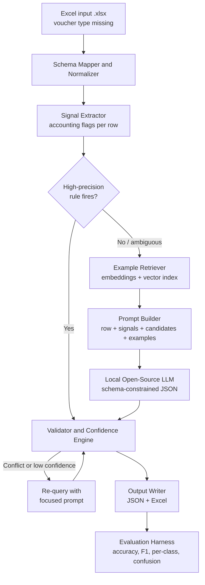
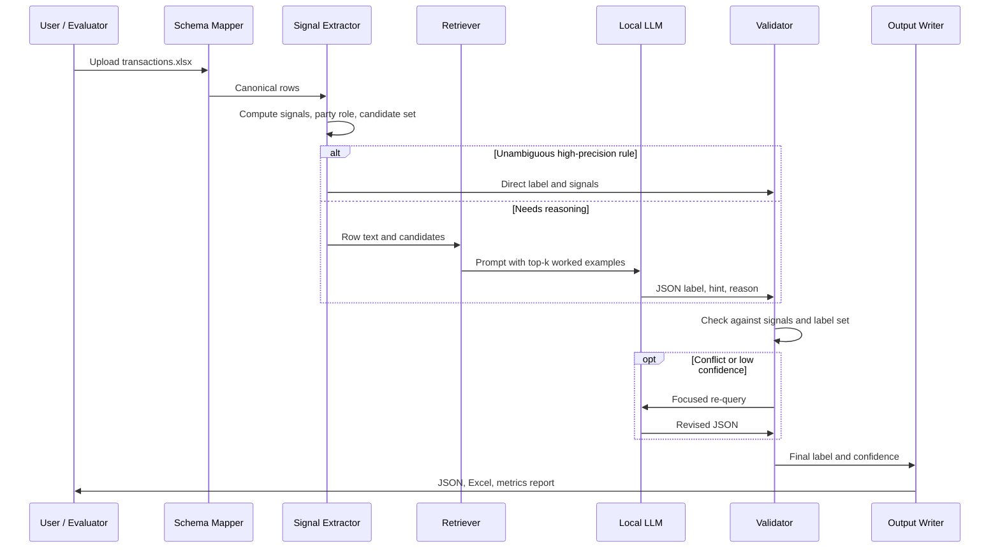
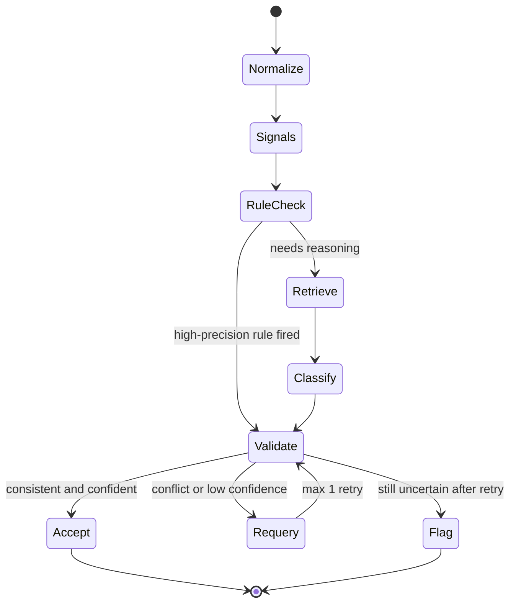

# MidNighters


Skip to content
Using RKNEC Mail with screen readers

Conversations
 
Program Policies
Powered by Google
Last account activity: 4 hours ago
Details
# VoucherIQ: Hybrid Open-Source LLM Voucher Classifier

> Hacktober Fest | Open Source AI Hackathon | Track 4: VYOM+ Intelligent Voucher Classification Using Open-Source LLMs
>
> **Team:** `[Team Name]` | `[Member 1]`, `[Member 2]`, `[Member 3]`, `[Member 4]`

---

## At a Glance

| | |
|---|---|
| **Problem** | Assign the correct accounting voucher type (1 of 27) to each already-structured transaction row, where the voucher-type column has been removed |
| **Approach** | Deterministic rules for the obvious rows, retrieval-grounded local LLM reasoning for the ambiguous ones, and a validator that checks every answer |
| **Primary AI** | Locally hosted, quantized open-weight LLM/SLM (7B to 12B class) run through Ollama, with schema-constrained JSON output |
| **Privacy** | Fully local inference. No financial data leaves the machine and no proprietary API is used |
| **Output** | `voucher_type` per row in JSON and Excel, plus confidence, a one-line explanation and a review flag |
| **Evaluation** | One-command scripted report: accuracy, precision, recall, F1, per-category scores, confusion matrix, latency and memory |

**Four ideas that make VoucherIQ different from "just prompt an LLM":**

1. **Home-entity inference.** Purchase vs Sales is a question of *whose books these are*, so the system works out who "we" are and gives the model a `party_role` signal instead of leaving it to guess.
2. **Signals, not keywords.** Every decision is based on combinations of fields (payroll fields, debit/credit structure, return references, currency, order or delivery references), not on a single word.
3. **Tiered inference.** Unambiguous rows skip the LLM, ambiguous rows get one grounded LLM call, and conflicts get exactly one focused retry. This keeps speed and cost low.
4. **Abstain and flag.** When evidence is insufficient the system raises a review flag rather than forcing a confident wrong answer.

---

## Table of Contents

1. [Project Name](#1-project-name)
2. [Problem Statement](#2-problem-statement)
3. [Project Overview](#3-project-overview)
4. [Proposed Solution](#4-proposed-solution)
5. [Objectives](#5-objectives)
6. [Target Users / Use Case](#6-target-users--use-case)
7. [Open-Source AI Technology Selected](#7-open-source-ai-technology-selected)
8. [Why This Technology Was Selected](#8-why-this-technology-was-selected)
9. [AI's Role in the System](#9-ais-role-in-the-system)
10. [System Architecture](#10-system-architecture)
11. [Component-Level Architecture](#11-component-level-architecture)
12. [Data / Information Flow](#12-data--information-flow)
13. [Agentic Workflow](#13-agentic-workflow)
14. [Technology Stack](#14-technology-stack)
15. [Expected Features](#15-expected-features)
16. [Implementation Approach](#16-implementation-approach)
17. [Expected Final Output](#17-expected-final-output)
18. [Future Scope / Scalability](#18-future-scope--scalability)
19. [Open-Source Dependencies / Components](#19-open-source-dependencies--components)
20. [Expected Challenges and Mitigation](#20-expected-challenges-and-mitigation)

**Appendix A.** [Alignment with Judging Criteria and Submission Checklist](#appendix-a-alignment-with-judging-criteria-and-submission-checklist)

---

## 1. Project Name

**VoucherIQ**: a hybrid (rules + retrieval + open-source LLM) classifier that assigns the correct accounting voucher type to structured transaction records.

---

## 2. Problem Statement

Accounting systems need every transaction filed under the right **voucher type** (Purchase, Sales, Payment, Contra, Journal, Salary, Credit Note and so on). Today this is done by hand or with brittle keyword rules, which fail because **the same fields mean different things in different contexts**:

- A row with a supplier, GST and item lines could be a **Purchase** or a **Sales**, depending on which side of the transaction the business sits.
- A bank-to-bank movement looks like a **Payment** and a **Receipt**, but is actually a **Contra**.
- A return looks like a normal invoice, but must be a **Debit Note** or **Credit Note**.
- Inventory movements (**Material In/Out**, **Stock Journal**) look like purchases and sales but carry no commercial invoice meaning.

The task: given an Excel file of already-structured transactions **with the voucher-type column removed**, predict exactly one voucher category per row, using reasoning over **multiple fields together**, with an **open-source LLM/SLM as the primary intelligence layer**, and make the result **reproducible and programmatically evaluable**.

This is explicitly **not** an OCR or invoice-extraction problem.

---

## 3. Project Overview

VoucherIQ is a pipeline, not a single prompt. It reads a transaction spreadsheet, normalizes it, computes explainable accounting signals, retrieves similar worked examples, and asks a **locally running open-source LLM** to choose a voucher category in a strict, machine-readable format. A validator then checks the answer against the signals before it is accepted. Low-confidence or conflicting rows are re-examined or flagged instead of being silently guessed.

| Item | Detail |
|---|---|
| Input | Excel (.xlsx) of structured transactions, voucher type missing |
| Output | One voucher type per row (JSON and Excel), plus optional confidence and short explanation |
| Core intelligence | Open-source / open-weight LLM or SLM running locally |
| Supporting layers | Schema mapper, signal extractor, example retrieval, validator, evaluation harness |
| Constraint honored | No proprietary API is used for classification |

---

## 4. Proposed Solution

A **five-stage hybrid pipeline**:

1. **Schema Mapper & Normalizer**: handles unknown column names, missing values, mixed formats and currencies.
2. **Signal Extractor**: derives accounting-meaningful flags from the whole row (for example *has payroll fields*, *has debit/credit indicator*, *has return reference*, *cross-border or currency flag*, *has delivery/order reference but no tax invoice*, *party role relative to the home business*).
3. **Retrieval of Worked Examples (RAG)**: finds the most similar labeled examples from a curated example bank and injects them into the prompt as few-shot guidance.
4. **LLM Classifier**: a local open model reasons over the row, the signals, the candidate categories and the examples, and returns schema-constrained JSON.
5. **Validator & Confidence Engine**: checks the LLM output against hard accounting rules and signals, re-queries on conflict, and produces a calibrated confidence score.

**Why hybrid and not "just prompt an LLM":** pure keyword rules cannot separate semantically close categories, and a pure LLM without grounding is inconsistent, slow and prone to guessing. Combining deterministic signals, retrieval and an LLM gives accuracy, consistency and speed together.

---

## 5. Objectives

1. Classify each transaction into exactly one of the **27 target voucher categories** with high accuracy and F1.
2. Specifically perform well on the **hard confusable pairs** (listed in Section 20).
3. Use an **open-source / open-weight LLM or SLM as the primary classifier**, run locally.
4. Handle **missing, incomplete and ambiguous** records gracefully (flag, do not hallucinate).
5. Emit **structured, programmatically evaluable output** (JSON and Excel).
6. Provide a **reproducible evaluation method** (fixed seeds, pinned model versions, deterministic decoding, scripted metrics).
7. Keep **inference fast and resource-efficient** (batching, caching, skipping the LLM for rows that are unambiguous).

---

## 6. Target Users / Use Case

| User | How they use VoucherIQ |
|---|---|
| Accountants and bookkeepers at SMEs | Upload a transaction sheet and get suggested voucher types to review instead of tagging row by row |
| Accounting software vendors (such as the sponsor, VYOM+) | Use it as the bridge between invoice extraction and **automated voucher creation** |
| Auditors and finance teams | Use flagged low-confidence rows to find likely misclassifications |
| Developers | Call the pipeline as a module or CLI in a larger accounting workflow |

**Primary use case:** an upstream system extracts invoice or transaction fields into a spreadsheet; VoucherIQ labels each row with the voucher type so that an accounting system can create the right entry automatically.

---

## 7. Open-Source AI Technology Selected

| Layer | Component | Role |
|---|---|---|
| **Primary classifier** | A locally hosted open-weight instruction-tuned LLM/SLM in the 7B to 12B class, quantized (candidates: **Qwen**, **Gemma**, **Llama**, **Mistral** families) | Reasons over the full transaction context and selects a voucher category |
| **Local inference runtime** | **Ollama** (with **llama.cpp** as an alternative) | Runs quantized models on commodity hardware, with JSON-schema constrained decoding |
| **Embedding model** | An open sentence-embedding model (for example a **BGE** or **E5** class model) | Encodes transactions and examples for similarity search |
| **Vector index** | **FAISS** (or **ChromaDB**) | Retrieves the most similar worked examples |
| **Classical ML helper** | **scikit-learn** | Evaluation metrics, and an optional lightweight classifier on signals if labeled data becomes available |

### Model selection plan

The exact model is **chosen by a short, scripted bake-off** on our validation set at the start of the final, not by popularity. All model licenses are checked before use.

| Tier | Candidates (4-bit quantized) | Why it is on the shortlist |
|---|---|---|
| **Primary (7B to 12B instruct)** | Qwen-family, Gemma-family, Llama-family, Mistral-family instruct models | Strong instruction following and reliable structured output at a size that runs locally |
| **Speed tier (about 3B to 4B)** | Small Qwen, Phi or Gemma-class models | Fallback for CPU-only machines, or a cheap first pass when the primary model is too slow |

| Bake-off criterion | Priority |
|---|---|
| Macro-F1 on the confusable pairs (Section 11) | Highest |
| Valid-JSON and valid-label rate under constrained decoding | High |
| Latency per row and peak memory | High |
| License permits our use | Mandatory |

---

## 8. Why This Technology Was Selected

| Decision | Reason |
|---|---|
| **LLM as the core** | The task is about *meaning*: the same fields imply different voucher types depending on context. Rules and bag-of-words models cannot reason over combinations of fields. |
| **Small / quantized open model (7B to 12B)** | Runs locally on a laptop-class GPU or even CPU, keeps inference fast and cheap, and avoids per-call API cost and rate limits. |
| **Local inference** | Financial data is sensitive; nothing leaves the machine. It also satisfies the rule that a proprietary API must not be the primary engine. |
| **Retrieval of examples** | The training labels are not provided. Curated examples let a general model learn *our* voucher conventions without fine-tuning, and make behavior easy to inspect and extend. |
| **Schema-constrained decoding** | Forces valid JSON with a label from the allowed list, which removes parsing errors and invalid categories. |
| **Open-source approach overall** | Reproducible (pinned weights), auditable, no vendor lock-in, and deployable on-premise inside an accounting firm. |

---

## 9. AI's Role in the System

The AI is **central to the decision**, not an add-on:

- **LLM:** performs contextual reasoning across all fields of a row to select the voucher category, and optionally writes a one-line explanation.
- **Embedding model + retrieval:** supplies grounded examples so the LLM follows consistent conventions.
- **Non-AI components** (schema mapper, signal extractor, validator) make the AI's input cleaner and its output verifiable, so the system is reliable rather than a black box.

Rows that are structurally unambiguous may skip the LLM for speed (see Section 12). Every ambiguous or semantically confusable row goes through the LLM.

---

## 10. System Architecture



---

## 11. Component-Level Architecture

| # | Component | Responsibility | Input | Output |
|---|---|---|---|---|
| 1 | **Schema Mapper** | Map arbitrary column names to a canonical schema using fuzzy matching and synonyms; coerce types; mark missing fields | Raw Excel | Canonical DataFrame |
| 2 | **Home-Entity Inference** | Infer which party is "us" (the business whose books these are) from party frequency across the sheet or an optional config value | Canonical DataFrame | `home_entity` and per-row `party_role` (we are buyer / seller / neither) |
| 3 | **Signal Extractor** | Compute explainable boolean and numeric flags per row | Canonical row | Signal vector |
| 4 | **Rule Engine** | Fire only for **high-precision** patterns (for example payroll-only fields, attendance fields) and constrain the candidate set | Signals | Candidate categories and optional direct label |
| 5 | **Example Bank** | Curated, labeled example transactions for each category and for confusable pairs | Built before and during the final | Embedded examples |
| 6 | **Retriever** | Embed the row and fetch the top-k similar examples (balanced across candidate categories) | Row text and candidates | k examples |
| 7 | **Prompt Builder** | Assemble category definitions, disambiguation rules, signals, examples and the row | All above | Prompt |
| 8 | **LLM Classifier** | Return `{voucher_type, confidence_hint, reason}` under a strict JSON schema, temperature 0 | Prompt | Raw prediction |
| 9 | **Validator** | Check prediction is in the label set, consistent with hard signals and the candidate set; detect conflicts | Prediction and signals | Accept / re-query / flag |
| 10 | **Confidence Engine** | Combine rule agreement, retrieval agreement and LLM self-consistency into a score | Validator state | Confidence 0 to 1 |
| 11 | **Output Writer** | Write JSON and Excel in the required structure | Final predictions | Files |
| 12 | **Evaluation Harness** | Compute metrics against any labeled data (validation set, or the organizers' hidden set offline) | Predictions and labels | Metrics report |

### Target label set (27 categories)

| Group | Categories |
|---|---|
| Commercial invoices | Purchase, Sales, Purchase Return / Debit Note, Sales Return / Credit Note |
| Cash and bank | Payment, Receipt, Contra, Advance / Prepayment, Expense |
| Adjustments | Journal |
| People | Salary / Payroll, Attendance |
| Orders | Purchase Order, Sales Order, Job Work In Order, Job Work Out Order |
| Goods movement | Receipt Note, Delivery Note, Rejection In, Rejection Out, Material In, Material Out, Stock Journal, Physical Stock |
| Cross-border | Import, Export |
| Fallback | Other / Miscellaneous |

### Cross-row context

Some decisions cannot be made from a single row, so the signal extractor also looks across the sheet:

| Cross-row signal | Used for |
|---|---|
| Party frequency across all rows | Inferring the home entity (the business whose books these are) |
| A return or credit/debit note whose referenced invoice number exists elsewhere in the sheet | Confirming Purchase Return vs Sales Return and their direction |
| Order or delivery reference that matches a later invoice | Separating an order or note from the invoice that follows it |
| Repeated counterparties and amounts | Detecting recurring payroll, rent and other expense patterns |

### Disambiguation guide for confusable categories

These are our working conventions, written into the prompt and the rule engine. They will be validated against the organizers' dataset at the start of the final and adjusted where the data shows a different convention.

| Confusable group | Decisive signals | Typical trap |
|---|---|---|
| **Purchase vs Sales** | Home entity is buyer (Purchase) or seller (Sales); GST direction | Fields are symmetrical, so direction is the whole problem |
| **Invoice vs Order** (Purchase / Sales vs Purchase Order / Sales Order) | Invoice number and tax invoice values vs order reference, expected delivery date and no invoice | Orders also carry items and values |
| **Return vs original** (Purchase Return / Debit Note, Sales Return / Credit Note) | Reference to an earlier invoice, return reason, direction from `party_role` | Looks like a normal invoice |
| **Payment vs Receipt vs Contra** | Money direction relative to the home entity; Contra has bank or cash accounts on both sides and no external party | Contra looks like a Payment and a Receipt at once |
| **Expense vs Purchase** | Expense has no stock or item quantities and a service or overhead nature (rent, utilities, fees) | Both can carry GST and a supplier |
| **Advance / Prepayment vs Payment** | Payment made ahead of goods or invoice, with no invoice reference | Same fields as an ordinary payment |
| **Journal vs Purchase / Sales** | Debit/credit-only structure, no party invoice, no payment mode | Adjustments may mention goods or parties |
| **Salary / Payroll vs Attendance vs Payment** | Payroll: employee, gross, deductions, pay period. Attendance: days or hours with no money | Payments to individuals look alike |
| **Goods movement** (Receipt Note, Delivery Note, Rejection In/Out, Material In/Out, Stock Journal, Physical Stock) | Inward vs outward direction, link to an order, quantity without commercial value, internal transfer or conversion (Stock Journal), counted quantity with no counterparty (Physical Stock) | Quantities appear, but no invoice meaning |
| **Import / Export vs ordinary trade** | Foreign currency, foreign party, customs or shipping fields | Looks like Purchase or Sales until the cross-border cue is used |
| **Job Work In / Out Order** | Job-worker party, process or job reference | Resembles an ordinary order |

---

## 12. Data / Information Flow



### Data contract

| Stage | Format | Key fields |
|---|---|---|
| Input | Excel rows | seller, buyer, invoice number, date, item descriptions, quantities, taxable value, GST, discounts, freight, payment info, currency, import/export details, payroll info, debit/credit info, return info, order and delivery references |
| Internal | Canonical records | normalized fields, signals, `party_role`, candidate categories |
| Output | JSON / Excel | `invoice_number`, `voucher_type`, optional `confidence`, optional `explanation`, `flag_for_review` |

**Example output (minimum structure):**

```json
{ "invoice_number": "INV-2026-1042", "voucher_type": "Purchase" }
```

**Extended (optional) structure:**

```json
{
  "invoice_number": "INV-2026-1042",
  "voucher_type": "Purchase",
  "confidence": 0.93,
  "explanation": "Supplier invoice with GST and item lines; home entity is the buyer.",
  "flag_for_review": false
}
```

### Worked examples (illustrative data)

These three rows show why signals and the validator matter. Party names are fictional.

| Row | Key fields | Signals computed | Path through the pipeline | Result |
|---|---|---|---|---|
| **A** | Seller `Sharma Traders`, buyer `Acme Components Pvt Ltd`, INV-2026-1042, three item lines, GST charged | `party_role = we are buyer`, has item lines, has GST, no return reference | No rule fires, so retrieve examples, one LLM call, validator agrees | **Purchase**, high confidence |
| **B** | Same layout, but seller is `Acme Components Pvt Ltd` and buyer is `Bright Retail LLP` | `party_role = we are seller` | Same path as A | **Sales**, high confidence |
| **C** | From `Current A/c`, to `Cash`, amount only, no external party, no invoice number | Both sides bank or cash, no counterparty, no tax fields | LLM first leans to Payment; the validator sees the bank-to-cash signal conflict, triggers one focused re-query | **Contra**, flagged only if still uncertain |

Rows A and B are identical except for who the home entity is. This is exactly the case where a keyword rule or an ungrounded LLM fails and the `party_role` signal succeeds.

---

## 13. Agentic Workflow

VoucherIQ is **not** a free-roaming autonomous agent. It is a **bounded, deterministic multi-step workflow** in which the LLM acts inside a controlled loop. This keeps results reproducible and fast.



| Step | Behavior | Bound |
|---|---|---|
| Rule check | Skip the LLM only for patterns with very high precision | Rules are conservative and limited to categories with unmistakable fields |
| Classify | One schema-constrained LLM call at temperature 0 | Deterministic |
| Validate | Compare to signals and candidate set | Rule-based |
| Re-query | One focused retry with the conflicting signals explained | Maximum 1 retry per row |
| Flag | Mark `flag_for_review` instead of forcing a wrong answer | Always terminates |

### Inference tiers

| Tier | Used for | LLM calls per row |
|---|---|---|
| **0. Rule shortcut** | Unmistakable patterns such as payroll-only or attendance-only fields | 0 |
| **1. Grounded single pass** | Most rows: signals plus retrieved examples plus constrained JSON output | 1 |
| **2. Focused re-query** | Validator found a conflict or low confidence | 1 extra (maximum) |
| **3. Flag for review** | Still uncertain after the retry | 0 extra |

Identical canonical rows are served from a cache, so repeated patterns cost nothing.

### How confidence is computed

The model's own self-reported confidence is treated as a weak hint and is **never trusted alone**. The confidence score combines:

| Component | Meaning |
|---|---|
| Rule agreement | The signals and rule engine support the predicted label |
| Retrieval agreement | Share of the top-k retrieved examples that carry the predicted label |
| Validator result | Pass, conflict resolved by re-query, or unresolved |
| LLM confidence hint | Low-weight input |

Weights and the review threshold are tuned on our held-out validation slice, and we check calibration (does 0.9 confidence really mean about 90 percent correct) before reporting the score.

---

## 14. Technology Stack

| Area | Technology |
|---|---|
| Language | Python 3.10+ |
| Data handling | pandas, openpyxl |
| Fuzzy column matching | RapidFuzz |
| Schema validation | Pydantic |
| LLM runtime | Ollama (llama.cpp as fallback) |
| Models | Open-weight instruction-tuned LLM/SLM (Qwen / Gemma / Llama / Mistral class), quantized |
| Embeddings | Open sentence-embedding model (BGE / E5 class) |
| Vector search | FAISS or ChromaDB |
| Evaluation | scikit-learn (accuracy, precision, recall, F1, confusion matrix) |
| Interface | Command-line tool; optional lightweight Streamlit viewer for inspecting predictions |
| Reproducibility | Pinned dependencies and model versions, fixed random seeds, temperature 0 |
| Version control | Git and GitHub, public, with an open-source license |

---

## 15. Expected Features

- Reads any reasonable Excel layout through **automatic column mapping**
- **27-category** voucher prediction, one label per row
- **Home-entity inference** to separate Purchase from Sales, and Purchase Return from Sales Return
- **Explainable signals** shown beside each prediction
- **Retrieval-grounded few-shot prompting** for consistent conventions
- **Strict JSON output** with only valid labels
- **Confidence score** and **short explanation** per row (optional fields)
- **Review flags** for ambiguous or incomplete rows
- **Batch processing with caching** for speed
- **One-command evaluation** that reports accuracy, precision, recall, F1, per-category scores and a confusion matrix
- Everything runs **locally**, so no data leaves the machine

---

## 16. Implementation Approach

### Before the final (design only, no code in this repository)

- Define the canonical schema and column synonym list
- Write category definitions and disambiguation rules for each confusable pair
- Prepare the example bank plan (target of several examples per category, with extra for confusable pairs)

### During the final hackathon (time-boxed phases)

| Phase | Work | Done when | Owner (planned) |
|---|---|---|---|
| **1. Foundations** | Ingest the organizers' Excel, build schema mapper and normalizer, set up the repository, pinned environment and Ollama | The Excel loads, columns map to the canonical schema, and a test prompt returns valid JSON from the local model | Member 1 |
| **2. Signals and rules** | Build signal extractor, home-entity inference and the conservative rule engine | Every row gets a signal vector and `party_role`; rules fire only on unmistakable patterns | Member 2 |
| **3. LLM core** | Prompt builder, schema-constrained decoding, retrieval over the example bank, model bake-off | One model is chosen by the bake-off and classifies rows end to end | Member 3 |
| **4. Validation and metrics** | Validator, confidence engine, evaluation harness, confusion-matrix report | The evaluation script runs on any labeled file and prints the full report | Member 4 |
| **5. Integration and hardening** | End-to-end run, speed tuning (batching, caching, rule shortcut), failure handling | Full sheet processed with no crashes, with throughput measured | All |
| **6. Demo and docs** | Final README, run instructions, results table, optional viewer | A fresh clone reproduces the reported results | All |

**Milestone rule:** a baseline (signals plus LLM, no extras) must work end to end by the midpoint of the event. Retrieval tuning, the re-query loop and the viewer are improvements on top of a working system.

### Handling the absence of training labels

The organizers provide an **unlabeled** Excel file. Therefore:

1. The system works **zero-shot and few-shot** and does not require fine-tuning.
2. We build a **small labeled validation set** ourselves (hand-labeled rows from the provided file plus synthetic transactions that follow accounting conventions) to tune prompts, rules and thresholds.
3. If any labeled sample is provided, it is added to the example bank and the validation set.
4. If time permits, a **LoRA / QLoRA fine-tune** of a small model on the curated set is an optional stretch goal, not a dependency.

### Reproducible evaluation

- Fixed seeds, pinned package and model versions, temperature 0
- A scripted evaluation that takes any labeled file and prints accuracy, macro and weighted precision, recall, F1, per-category table and confusion matrix
- Separate reporting for **confusable pairs** and **incomplete-field rows**
- Latency and throughput (rows per second) and peak memory reported alongside accuracy

### Ablation study (shows every layer earns its place)

| Variant | What it tests |
|---|---|
| Rules and signals only | How far deterministic logic goes without an LLM |
| LLM zero-shot | The raw model, with no signals or examples |
| LLM plus signals | Value of home-entity and accounting signals |
| LLM plus signals plus retrieval | Value of grounded few-shot examples |
| **Full hybrid** (plus validator and re-query) | Our final system |
| Optional: LoRA/QLoRA fine-tuned small model | Stretch goal, compared against the full hybrid |

Each variant is reported on overall macro-F1, F1 on the confusable groups from Section 11, valid-JSON rate, flagged-row rate and rows per second.

**Targets we hold ourselves to:** 100 percent schema-valid outputs with no label outside the 27 categories, deterministic results across repeated runs, and a flagged-row rate that we report openly rather than hide.

---

## 17. Expected Final Output

1. A **working classifier** (CLI) that takes an Excel file and produces a voucher type for every row
2. **JSON and Excel outputs** in the required structure, with optional confidence, explanation and review flag
3. A **reproducible evaluation report**: overall and per-category metrics, confusion matrix, speed and memory figures
4. A **public GitHub repository** with an open-source license, run instructions and the documented architecture
5. A short **demonstration** on previously unseen records

### Planned interface and repository layout (built during the final)

```bash
# Classify an Excel file
python -m voucheriq classify --input transactions.xlsx --out predictions.xlsx --json predictions.json

# Evaluate against any labeled file
python -m voucheriq evaluate --pred predictions.json --labels labeled.xlsx
```

```text
voucheriq/
  schema/        column mapping, normalization, home-entity inference
  signals/       signal extractor and rule engine
  retrieval/     example bank, embeddings, vector index
  llm/           prompt builder, constrained decoding, re-query
  validate/      validator and confidence engine
  evaluate/      metrics, ablations, confusion matrix
  app/           optional Streamlit viewer
```

This layout is a plan only. This qualifier repository contains just the README.

---

## 18. Future Scope / Scalability

| Direction | Description |
|---|---|
| **Fine-tuning** | LoRA / QLoRA on accumulated labeled data to improve accuracy and shrink the model for faster inference |
| **Active learning** | Reviewers correct flagged rows; corrections feed back into the example bank |
| **Pipeline bridge** | Plug directly after an invoice-extraction stage (OCR or document AI) and before automated voucher creation |
| **Scale** | Batch and parallel inference, response caching, and moving to a serving engine such as vLLM for large volumes |
| **Multi-entity support** | Explicit per-company configuration for home entity, chart of accounts and local conventions |
| **Multi-regime support** | Extend rule and prompt packs to other tax regimes and voucher taxonomies |
| **Hybrid ML** | Train a light classifier on signals plus embeddings to handle the easy majority cheaply, reserving the LLM for hard rows |

---

## 19. Open-Source Dependencies / Components

| Component | Purpose | License (to be verified before use) |
|---|---|---|
| Ollama / llama.cpp | Local LLM inference | MIT |
| Open-weight LLM/SLM (Qwen / Gemma / Llama / Mistral class) | Primary classifier | Varies per model; checked per release |
| Open embedding model (BGE / E5 class) | Similarity search | Permissive, to be confirmed |
| FAISS / ChromaDB | Vector search | MIT / Apache-2.0 |
| pandas, openpyxl | Spreadsheet handling | BSD / MIT |
| RapidFuzz | Fuzzy column matching | MIT |
| Pydantic | Output schema validation | MIT |
| scikit-learn | Metrics, optional classical model | BSD |
| Streamlit (optional) | Result viewer | Apache-2.0 |

Our own code will be released publicly under an open-source license (for example Apache-2.0 or MIT).

---

## 20. Expected Challenges and Mitigation

### Technical challenges

| Challenge | Why it is hard | Mitigation |
|---|---|---|
| **Unknown dataset schema** | Column names and fields are only seen at the final | Fuzzy schema mapper with synonym lists; every signal tolerates missing fields |
| **No labels provided** | Cannot train a supervised model directly | Few-shot retrieval over a curated bank; our own validation set; fine-tuning only as a stretch |
| **Purchase vs Sales** | Fields are symmetrical; direction depends on who "we" are | Home-entity inference from party frequency (or optional config) and a `party_role` signal fed to the model |
| **Purchase Return vs Sales Return** | Looks like a normal invoice with reference to an earlier one | Return and reference signals, plus direction from `party_role`, plus targeted examples |
| **Contra vs Payment / Receipt** | Both are money movements | Signal for bank-to-bank or cash-to-bank accounts on both sides; explicit Contra definition and examples |
| **Journal vs Purchase / Sales** | Adjustments can mention goods or parties | Signals for missing commercial fields (no invoice, no delivery) plus debit/credit-only structure |
| **Inventory vs Purchase / Sales** | Goods movement has quantities but no commercial value | Signals for quantity-only rows, material or stock terms, delivery or receipt references, absence of tax invoice fields |
| **Import / Export vs ordinary trade** | Needs currency and cross-border cues | Currency, foreign-party and customs-field signals as candidate constraints |
| **Salary / Payroll vs other payments** | Payments to individuals look alike | Payroll-specific fields (employee, gross, deductions) as a high-precision rule |
| **Missing or ambiguous fields** | Real data is messy | Validator flags uncertain rows (`flag_for_review`) and falls back to **Other / Miscellaneous** only when evidence is genuinely insufficient |
| **LLM inconsistency** | Free-text answers vary run to run | Temperature 0, schema-constrained decoding, label-set validation, one controlled retry |
| **Prompt length and speed** | Many categories and examples cost tokens and time | Candidate-set pruning, top-k balanced retrieval, rule shortcut for unambiguous rows, batching and caching |
| **Limited hardware** | Local GPU may be small | Quantized 7B to 12B models, CPU fallback, model chosen by the bake-off on speed and accuracy |
| **Overfitting to our own examples** | Our validation set is not the hidden set | Keep a held-out slice, report per-category results, avoid category-specific hardcoding beyond signals |
| **Expense vs Purchase, Advance vs Payment** | Same party and amount fields, different accounting meaning | Item and quantity signals, invoice-reference signals, and targeted examples for each pair |
| **Order vs Invoice, and the goods-movement family** | Orders, notes, rejections and material movements share fields with invoices | Direction (inward or outward), order-link and no-commercial-value signals, plus the disambiguation guide in Section 11 |
| **Wrong home-entity guess** | A frequency heuristic can fail if the sheet mixes several businesses | Optional config value overrides inference; low-confidence inference marks affected rows for review |
| **Taxonomy conventions differ from ours** | Our category definitions are working conventions | Validate definitions on the organizers' data first thing in the final and update the prompt and rules |

### Project risks

| Risk | Mitigation |
|---|---|
| Too little time in the final | Pipeline is modular; a baseline (signals plus LLM) works end to end by the midpoint, and extras are added afterwards |
| Team members join at different times | Clear module ownership and a simple, documented interface between components |
| Model download or setup issues | Set up and test the runtime and a fallback model early in the final |

---

## Appendix A. Alignment with Judging Criteria and Submission Checklist

### Where each qualifier criterion is addressed

| Evaluation criterion | Where to look |
|---|---|
| Clarity of the problem | Sections 2 and 6 |
| Originality and relevance of the solution | At a Glance, Sections 4 and 11 (home-entity inference, cross-row context) |
| Technical depth and quality of architecture | Sections 10 to 13 |
| Appropriate open-source AI selection and understanding of it | Sections 7 to 9 |
| Meaningful integration of AI | Sections 9 and 13 |
| Feasibility within the final hackathon | Section 16 (phases, exit criteria, milestone rule) |
| Completeness of the proposal | All 20 sections plus this appendix |
| Impact, scalability and extensibility | Sections 6 and 18 |
| Overall coherence | Worked examples in Section 12 and the ablation plan in Section 16 |

### Submission checklist

- [x] Repository contains only `README.md`
- [x] All 20 mandatory sections are present
- [x] Problem statement and target users are defined
- [x] Open-source AI technology is named, justified, and its role explained
- [x] Architecture, data flow and dependencies are documented with diagrams
- [x] Implementation approach is realistic for the final
- [x] Challenges and mitigation are included
- [ ] Team name and member names filled in at the top
- [ ] README previewed on GitHub (Mermaid diagrams and tables render)
- [ ] Repository submitted before the 8 October deadline

---

*This README is a technical proposal for the qualifier round. Implementation will be built and demonstrated in the final hackathon.*
README (2) (1).md
Displaying README (2) (1).md.
